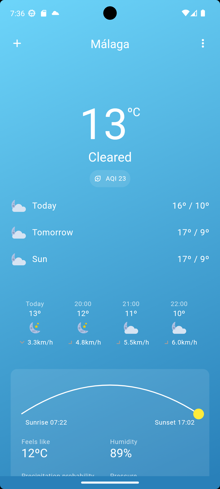
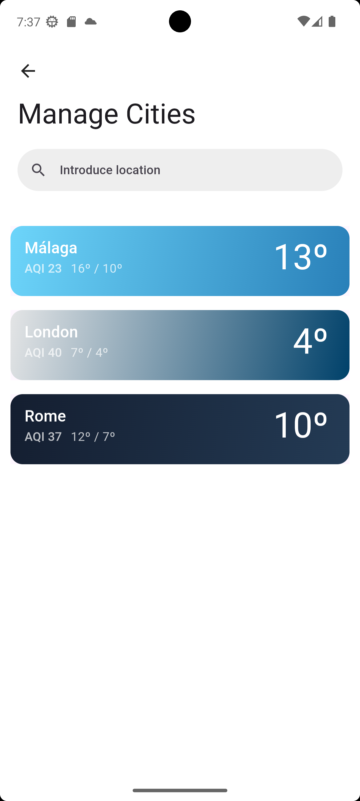
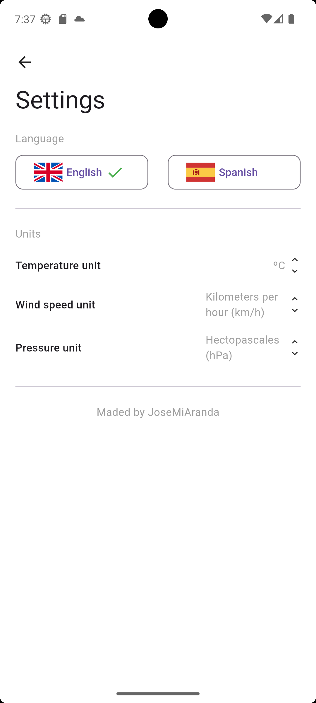
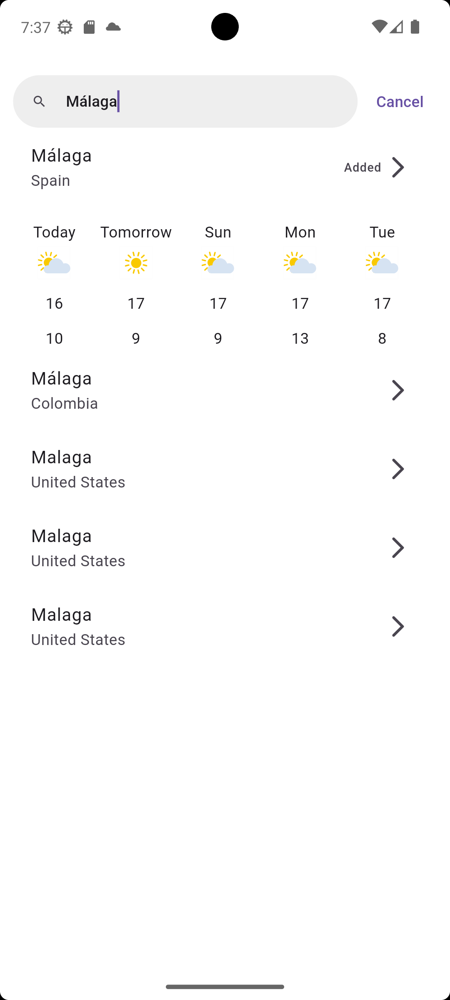
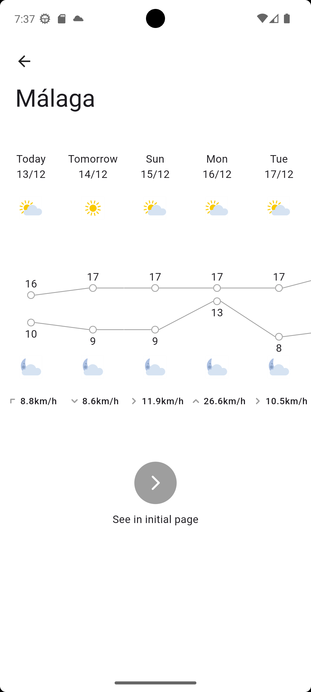

# ☀️ xiaomi_weather_clone

A new Flutter project usign the documentation of [Weather Bloc](https://bloclibrary.dev/tutorials/flutter-weather/) and the ui design of [Xiaomi Weather App](https://play.google.com/store/apps/details?id=com.miui.weather2).

# 📱 Plattforms

- Android
- Windows
- Web (limited functionality)
- iOS (not tested)

# 📓 Features

### Reactive programming
The app uses reactive programming to update the UI when the data changes.

### Control of states
Using blocs makes it easier to clone the app and perform tests.

### Customized packages
Packages that are not part of the bloc library that constrols the data layer.

### Testing
Both custom packages and blocs are tested usign bloc and mocktail.

# 📷 Screenshots

<table border="1">
    <thead>
        <tr>
            <th style="text-align: center; font-size: 16px">Weather</th>
            <th style="text-align: center; font-size: 16px">Weathers</th>
            <th style="text-align: center; font-size: 16px">Settings</th>
        </tr>
    </thead>    
  <tbody>
    <tr>
        <td>
            
        </td>
        <td>
            
        </td>
        <td>
            
        </td>
    </tr>
  </tbody>
  <thead>
        <tr>
            <th style="text-align: center; font-size: 16px">Search</th>
            <th style="text-align: center; font-size: 16px">Confirm</th>
        </tr>
    </thead>
    <tbody>
     <tr>
        <td>
            
        </td>
        <td>
            
        </td>
    </tr>
  </tbody>
</table>
